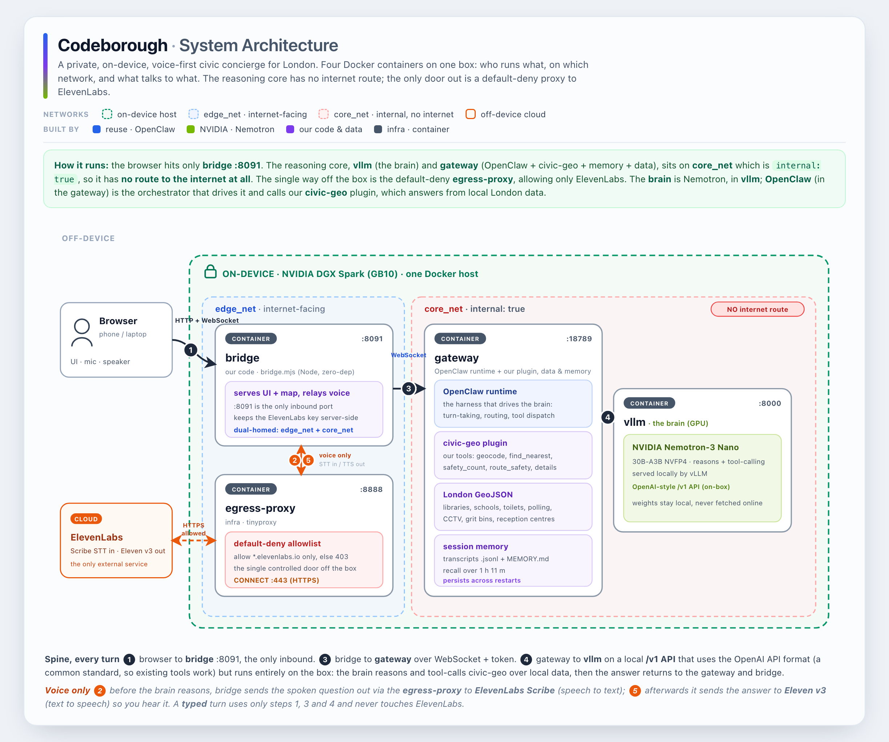

# Codeborough

A **private, on-device, voice-first civic concierge** for London. Speak a question -
*"where's the nearest accessible public toilet to Triton Square?"*, *"where do I vote and can I
get there step-free?"* - and Codeborough finds the right civic service near you, tells you how to
get there on **monitored, well-served streets**, and remembers your situation across the whole
conversation. Everything runs on the edge; your location and queries never leave the device.

Built for **NVIDIA Hack for Impact - London** (Public Services track), targeting the
**Nemotron** and **ElevenLabs** bounties as well.

> **Current direction is v3.** See [`docs/build-plan.md`](docs/build-plan.md) for the full
> architecture, task split, and demo script. This README is the front door; the build plan is the
> source of truth.

## The problem

Commercial maps (Google, Apple) already do shops, restaurants and big POIs well - libraries
included - so this isn't about finding a café. The gap is the **civic layer that councils publish
but commercial maps don't ingest**: where you vote, winter grit bins, emergency rest centres,
council safety cameras, and the civic detail on public toilets (accessible? baby-change? council
hours). That data is open but **scattered across 33 separate council portals** and hard to query in
plain language - hardest for the people who most need it (new arrivals, the elderly, the visually
impaired, the privacy-conscious).

## Our solution

A voice agent that we **build on OpenClaw**, grounded in real City of London open data, running
entirely on an NVIDIA DGX Spark / ZGX Nano (GB10):

- **Voice in/out** via **ElevenLabs** (Talk mode: Scribe STT + Eleven v3 TTS).
- **Brain:** **NVIDIA Nemotron 3** (Nano-30B-A3B) served locally via vLLM/Ollama, doing
  tool-calling - optionally with a Nemotron retriever + content-safety guard for breadth.
- **Grounding:** our own [`plugins/civic-geo/`](plugins/civic-geo/) OpenClaw tool plugin queries
  the London GeoJSON datasets locally (`geocode`, `find_nearest`, `get_details`, `safety_count`,
  `list_coverage`).
- **Memory:** one long-lived OpenClaw session + persistent memory, so it recalls earlier turns
  (the ElevenLabs ≥ 1 h 11 m context-retention bounty).

Why on-device matters: **privacy** (location/queries stay on the box), **richer answers** (local
data surfaces detail a map app can't), and **anywhere** (self-contained, no cloud dependency).

### Three things it does

1. **Find the civic thing maps miss** - the nearest polling station, rest centre, library or
   accessible public toilet, and how to get to it. *(polling stations, reception centres, libraries,
   schools, public toilets)* — we return the **nearest** facility (not your *assigned* station/catchment yet; that's a postcode-lookup next step).
2. **Get me there safely** - prefers monitored, busy, well-served streets. *(CCTV, grit bins)*
   Honest framing: CCTV here is mostly traffic/town cameras = busy roads, **not** crime surveillance.
3. **Tell me about it** - hours, accessibility, what's there. *(all datasets)*

## Architecture

How the components come together - voice via ElevenLabs, brain via Nemotron, grounded by our
`civic-geo` plugin over local data, all orchestrated by OpenClaw on the device.



**📐 Interactive version → [`docs/architecture.html`](docs/architecture.html)** - open it in a
browser to toggle the *voice-turn* / *memory-recall* views and hover each box. (GitHub can't render
interactive HTML in a README, so the image above is a static preview of it; or view the HTML live via
[htmlpreview](https://htmlpreview.github.io/?https://github.com/pedroandreou/Codeborough/blob/main/docs/architecture.html)
when the repo is public.)

**Flow:** user speaks → ① ElevenLabs Scribe STT → ② OpenClaw Gateway → ③ Nemotron reasons and
calls tools → ④ `civic-geo` plugin → ⑤ queries the local GeoJSON → results return to Nemotron →
it composes a grounded answer → back through OpenClaw → ElevenLabs Eleven v3 TTS → user hears.
Session memory persists across turns, so it recalls earlier context (the ≥ 1 h 11 m ElevenLabs
bounty). Everything except the ElevenLabs voice calls runs on-device.

## Hackathon

| | |
|---|---|
| **Event** | NVIDIA Hack for Impact - London |
| **Theme** | Build autonomous systems that think, act, and run anywhere, for positive impact |
| **Platform** | On-device on NVIDIA DGX Spark / ZGX Nano (GB10 Grace Blackwell), open-source models |
| **Stack** | OpenClaw · NVIDIA Nemotron 3 · ElevenLabs · (NemoClaw/OpenShell optional) |
| **Track** | **Public Services** - improving access to and efficiency of city services |
| **Bounties** | Best use of Nemotron · ElevenLabs persistent agent (≥ 1 h 11 m + context retention) |
| **Team** | Codeborough |

## Repository contents

```
docs/build-plan.md          ← the plan (architecture, tasks, demo script) - START HERE
plugins/civic-geo/          ← our OpenClaw tool plugin over the datasets (the part we write)
datasets/<facility>/        ← London civic GeoJSON, per borough + a merged all-london file
```

| Path | What it is |
|---|---|
| [`docs/build-plan.md`](docs/build-plan.md) | **Build plan v3** - architecture, 3-dev task split, demo script, submission checklist |
| [`docs/setup-runbook.md`](docs/setup-runbook.md) | **Setup runbook** - exact on-the-box commands (Ollama/Nemotron, OpenClaw + ElevenLabs voice, plugin install, 71-min session) + current status |
| [`plugins/civic-geo/`](plugins/civic-geo/) | OpenClaw tool plugin: on-device GeoJSON lookups (see its [README](plugins/civic-geo/README.md)) |
| [`datasets/libraries/`](datasets/libraries/) | Libraries (42 across 4 boroughs) |
| [`datasets/reception-centres/`](datasets/reception-centres/) | Reception / rest centres (47 across 2 boroughs) |
| [`datasets/cctv/`](datasets/cctv/) | CCTV cameras (549 across 2 boroughs) |
| [`datasets/schools/`](datasets/schools/) | Schools (1000 across 4 boroughs) |
| [`datasets/public-toilets/`](datasets/public-toilets/) | Public toilets (216 across 5 boroughs) |
| [`datasets/polling-stations/`](datasets/polling-stations/) | Polling stations (464 across 7 boroughs) |
| [`datasets/grit-bins/`](datasets/grit-bins/) | Grit bins (376 across 4 boroughs) |
| [`datasets/SOURCES.md`](datasets/SOURCES.md) | Coverage matrix, sources, licences, caveats, refresh URLs |
| [`docs/london-structure.md`](docs/london-structure.md) | How London is organised and why facility data is split across sources |
| [`docs/data-scope-notes.md`](docs/data-scope-notes.md) | Historical pre-hackathon scope note (now settled - see the build plan) |
| [`LICENSE`](LICENSE) | Project licence |

Data covers 8 of 33 London authorities that publish these facilities as open location data;
coverage per facility is partial. The demo focuses on **Lambeth** (the one borough with CCTV *and*
all destination types). See [`datasets/SOURCES.md`](datasets/SOURCES.md) for the full matrix and caveats.

## Quick start

```bash
# Validate the data engine right now - zero install, no hardware needed:
node plugins/civic-geo/scripts/smoke.mjs
```

On the box, the agent is OpenClaw + a local Nemotron + ElevenLabs voice + the `civic-geo` plugin.
Full setup steps are in [`docs/build-plan.md`](docs/build-plan.md) and
[`plugins/civic-geo/README.md`](plugins/civic-geo/README.md).

## Team

**Codeborough**
